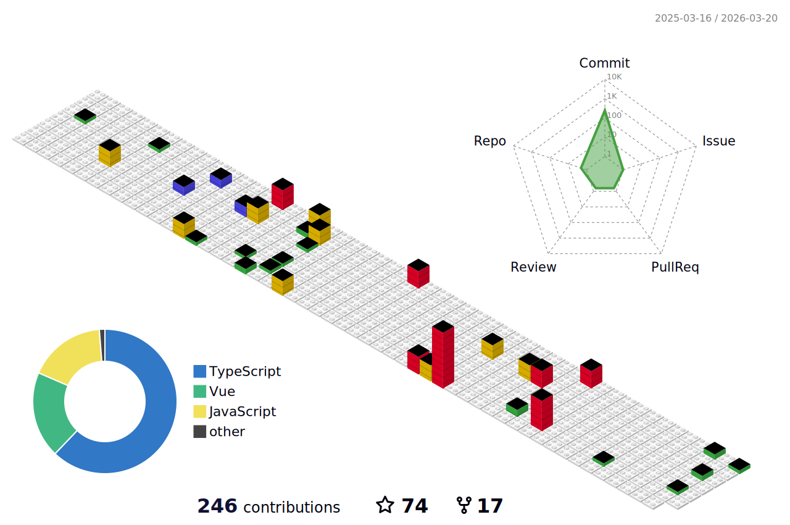

<div align="center" >

  
  
  ```
   __  __          ___    ___               __      __                 ___       __  __     
  /\ \/\ \        /\_ \  /\_ \             /\ \  __/\ \               /\_ \     /\ \/\ \    
  \ \ \_\ \     __\//\ \ \//\ \     ___    \ \ \/\ \ \ \    ___   _ __\//\ \    \_\ \ \ \   
   \ \  _  \  /'__`\\ \ \  \ \ \   / __`\   \ \ \ \ \ \ \  / __`\/\`'__\\ \ \   /'_` \ \ \  
    \ \ \ \ \/\  __/ \_\ \_ \_\ \_/\ \L\ \   \ \ \_/ \_\ \/\ \L\ \ \ \/  \_\ \_/\ \L\ \ \_\ 
     \ \_\ \_\ \____\/\____\/\____\ \____/    \ `\___x___/\ \____/\ \_\  /\____\ \___,_\/\_\
      \/_/\/_/\/____/\/____/\/____/\/___/      '\/__//__/  \/___/  \/_/  \/____/\/__,_ /\/_/
                                                        
  ```
  

  


  
  
  
  
  
  
  
  
  
  
  
  
  
  
  
  
  
  
  
  
  
  
  
  
  
  
  
  


  <picture>
    <source srcset="./profile-3d-contrib/profile-night-view.svg" media="(prefers-color-scheme: dark)">
    <source srcset="./profile-3d-contrib/profile-gitblock.svg" media="(prefers-color-scheme: light)">
    
  </picture>

</div>
